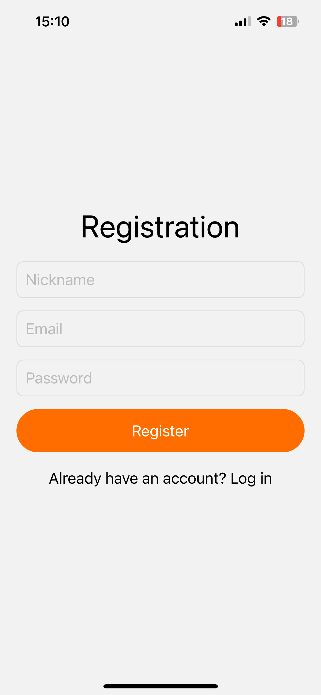
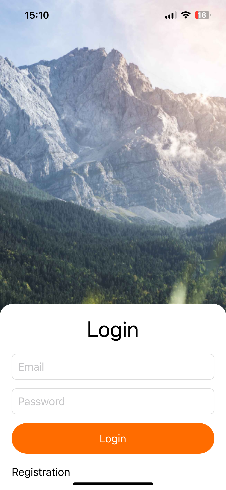
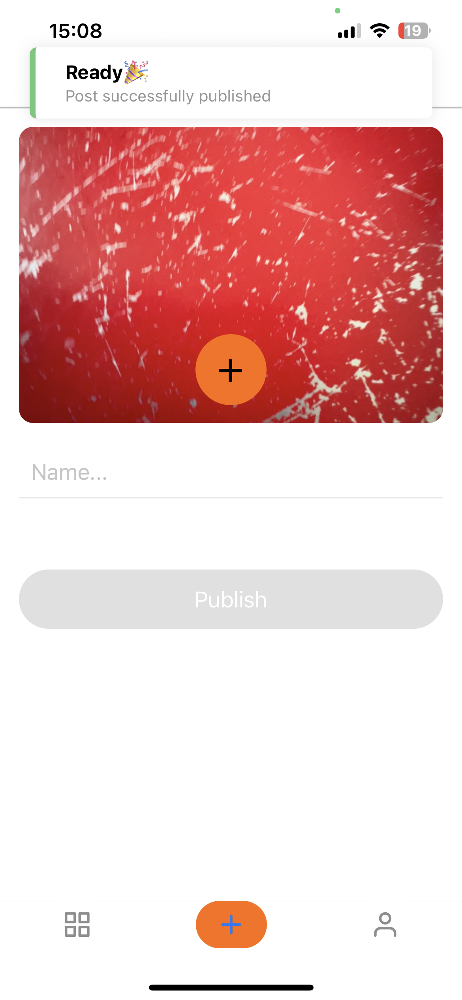
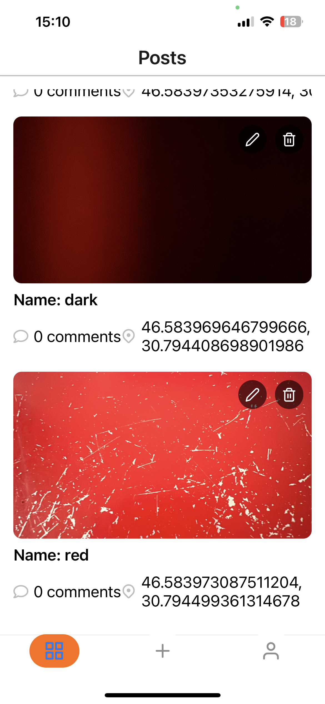
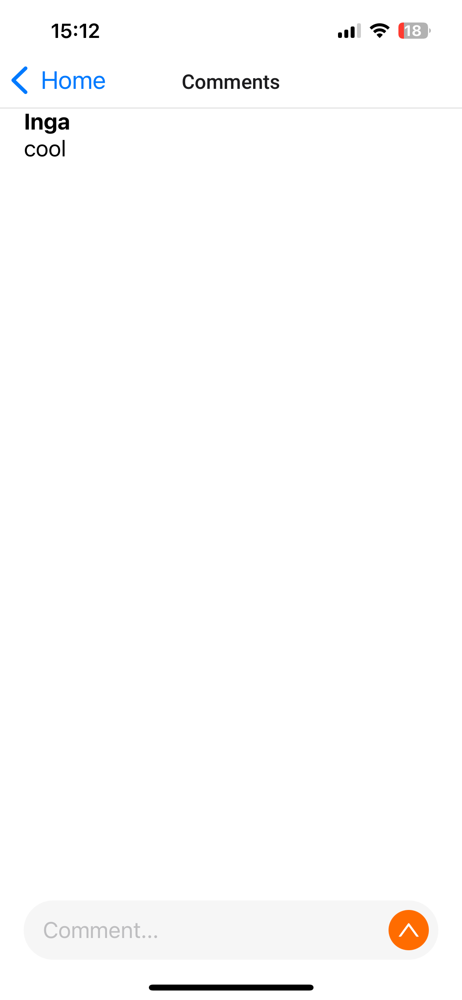
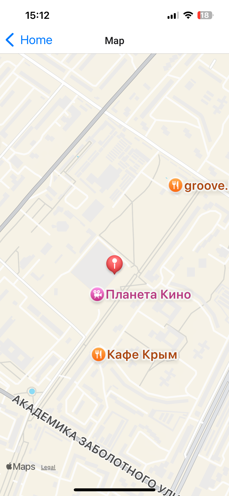

# 📱 React Native Social App

Mobile social application built with React Native and Expo.  
The app includes authentication, posts feed, comments system, maps integration and image uploads via Cloudinary.

---

## 🔗 Links

- 📱 Live App (Android): https://expo.dev/accounts/ingapie/projects/mobile-app-new/builds/2190a5ad-7143-44f2-97e2-44129025749d
- 🎥 Demo Video: https://youtube.com/shorts/mOmeCZME4-g?feature=share
- 💻 Source Code: https://github.com/IngaPirogova/react-native-social-app

---

## 🚀 Features

- User authentication (Firebase Auth)
- Create / delete posts
- Comments system (Firestore)
- Map integration (React Native Maps)
- Image upload via Cloudinary
- Profile with avatar update
- Real-time data updates

---

## 🛠 Tech Stack

React Native • Expo • Firebase • Redux Toolkit • React Navigation • Cloudinary • JavaScript

---

## ⚙️ Installation

git clone https://github.com/IngaPirogova/react-native-social-app
cd your-project
npm install
npx expo start

---

## 🛠 Build
eas build --platform android

---

## 📸 Screenshots

<

  
  
  
  
  
  
  

---